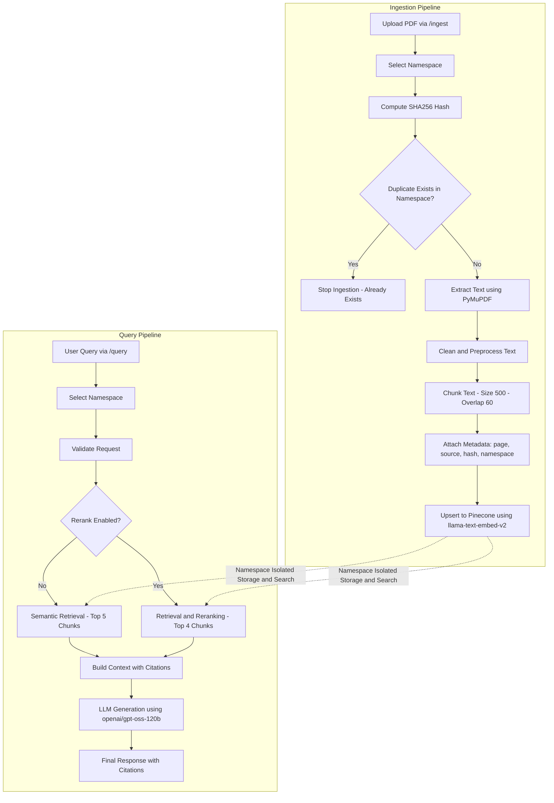

# RAG Pipeline with Precision Reranking

An enterprise-ready, high-performance Retrieval-Augmented Generation (RAG) pipeline built to extract, embed, retrieve, and generate highly accurate answers from complex PDF documents. Designed with a focus on low latency, citation accuracy, and scalability, this system leverages **FastAPI**, **Pinecone**, and **openai/gpt-oss-120b** to deliver a seamless query experience augmented by hybrid search and native reranking.

## Architecture & Data Flow



## System Impact & Capabilities

- **Idempotent Operations & Cost Savings**: Engineered a SHA-256 caching mechanism that reliably detects and blocks duplicate document uploads. This reduces redundant vector database upserts and significantly cuts API embedding costs for large-scale ingestion operations.
- **Precision Reranking to Maximize Relevance**: Implemented Pinecone's native reranking models within the retrieval loop, which reorders semantic search results and dramatically increases top-k hit relevance.
- **Source Citation Traceability for Trust**: The ingest pipeline structurally retains granular metadata (source document identity and exact page mappings), enabling the system to output strict, verifiable inline citations accompanying every generated claim.
- **High-Fidelity Document Processing**: Built robust PDF parsing streams using `PyMuPDF` with intelligent, page-aware text chunking that prevents data loss across pagination boundaries.
- **Microsecond Interference**: Integrated the powerful `openai/gpt-oss-120b` LLM engine configured for rigorous citation-driven generations without sacrificing strict latency thresholds.
- **Production-Ready API**: Cleanly segregated core business logic bound into a robust, asynchronous **FastAPI** server that guarantees scalability for concurrent requests and multi-tenant namespaces.

## Future Improvements & Extensibility

- **Asynchronous Ingestion Workflows**: Transitioning document chunking and vector embedding into asynchronous background queues (via Celery/RabbitMQ) to prevent API endpoint blocking during massive multi-document uploads.
- **Advanced Query Routing Strategies**: Incorporating an intent-classifier layer to dynamically route conversational queries to specialized vector indexes or specific prompt templates depending on the detected domain.

## Tech Stack

- **Backend Framework:** FastAPI, Python 3.11+
- **Vector Database & Reranker:** Pinecone (incorporating `llama-text-embed-v2`)
- **LLM Engine:** openai/gpt-oss-120b
- **Document Processing:** PyMuPDF, Hashlib

---

## Getting Started

### Prerequisites

- **Python 3.11+**
- **Pinecone Account** with an active API key
- **OpenAI API Key** (for gpt-oss-120b engine)

### Installation

1. **Clone the repository**:
   ```bash
   git clone "https://github.com/questinrest/rag-pipeline-reranker"
   cd rag-pipeline-reranker
   ```

2. **Create a virtual environment** (recommended):
   ```bash
   py -3.11 -m venv .venv
   .venv\Scripts\activate   # on Windows
   ```

3. **Install dependencies**:
   ```bash
   pip install -r requirements.txt
   ```

### Environment Configuration

Create a `.env` file in the project root (same directory as `code/`) alongside your configuration variables:

```dotenv
PINECONE_API_KEY=<your-pinecone-api-key>
OPENAI_API_KEY=<your-openai-api-key>
```
> **NOTE**: The application securely manages configuration variables via Pydantic constructs within `src/config.py`.

### Running the API Server

The core robust FastAPI application is housed in `src/api.py`. To spin up the local development server:

```bash
cd code
uvicorn src.api:app --reload
```

- The server exposes its secure footprint seamlessly at `http://127.0.0.1:8000`.
- Access the **Swagger UI** interactive documentation portal over at `http://127.0.0.1:8000/docs`.

---

## API Usage Reference

Rapidly interact with the backend infrastructure through the built-in Swagger payload docs or tools like Postman/cURL.

### 1. Ingest a Document (`POST /ingest`)
Uploads and executes processing loops over a PDF, injecting vectorized text payloads directly into isolated Pinecone namespaces. Intelligently skips duplicate records on identical payload inputs.

**Payload**:
```json
{
  "file_path": "C:\\Desktop\\file.pdf"
}
```
*(Note: Ensure backslashes correctly resolve with proper escapes on Windows environments, e.g., `"C:\\path\\to\\file.pdf"` or alternatively utilize standard forward slashes `/`)*

### 2. Query the Knowledge Base (`POST /query`)
Issues semantic natural language queries cascading through the embedded document vectors. Utilizing the `rerank: true` runtime override flag activates secondary precision pipelines improving contextual relevance bounds.

**Payload**:
```json
{
  "query": "What are the rules mentioned for employee onboarding?",
  "rerank": true
}
```

---

## Project Structure

```text
├─ src/                     # Core business logic
│   ├─ api.py               # FastAPI routing controllers and endpoints
│   ├─ config.py            # Environment configuration & internal variables
│   ├─ data_models.py       # Pydantic schemas validating inbound structures
│   ├─ ingestion.py         # PDF extraction, parsing, chunking, hashing routines
│   ├─ embedding.py         # Vectorization engines shaping payload upserts
│   ├─ retrieval.py         # Primary base vector similarity query services
│   ├─ reranker.py          # Post-retrieval pipeline precision rerank logic layer
│   ├─ generation.py        # Abstract LLM orchestration and prompt injections
│   └─ utils.py             # Functional and generic helper utilities
├─ docs/                    # Example PDFs and knowledgebase material
├─ .env                     # Local secure variables mapping (User Generated)
├─ requirements.txt         # Core foundational package dependencies
└─ README.md                # System-level documentation architecture
```
